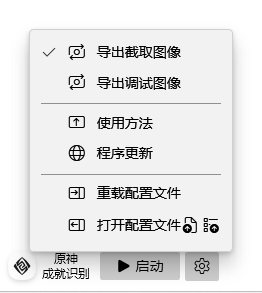
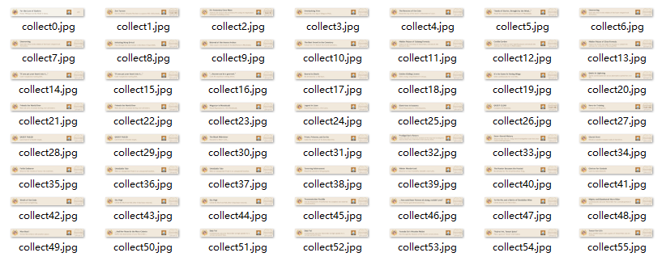

・[English](README.en.md) ・[中文](README.md) ・[日本語](README.jp.md)

[](https://github.com/genshin-matrix/genshin-achievement-ocr/releases)
[](https://github.com/genshin-matrix/genshin-achievement-ocr/releases)


# 原神成就识别

> GenshinAchievementOcr

原神成就识别，快速扫描成就页，目前仅支持「天地万象」的成就识别导出。

『OCR视觉识别＝安全无风险』

* 识别精度？
  * 限定1440x900窗口游戏方案可稳定提供高识别精度；
  * 仅支持英语高容错识别，准确率自测100%；
  * 后续会实装另一种全语言支持且保证准确率100%的方案；
  
* 识别速度？
  * 采用边自动滚动截取边识别方式1~2分钟完成；


## 截图






## 使用方法

1. 启动游戏（限定：1440x900窗口／英语语言），可在托盘右键「启动游戏」自动以合适设置启动。
1. 打开「天地万象」注意不要点击选中任何成就，点击启动进行自动开始OCR识别（快捷键<kbd>F11</kbd>）。
1. 采用边自动滚动截取边识别方式，待1~2分钟后结束将自动打开输出目录，导出的UIAF格式文件(.json)可使用如[寻空](https://github.com/xunkong/xunkong)软件打开。

- 如果无法正常自动模拟按键，请尝试将本程序添加至杀软白名单，或关闭杀软后使用。

> 输出目录的文件说明：
>
> ```python
> ocr/ # 存放「导出截取图像」图像目录
> ocr/debug # 存放「导出调试图像」图像目录
> *.log # 仅调试模式下的日志文件
> *.json # 以UID命名的「UIAF文件」
> *.ocr # 识别的「中间调试文件」
> ```

## 常见问题

1. 若安装包无法安装，请确保你的系统已安装应用商店，安装包依赖商店架构 (MSIX)。

2. 运行环境是net6.0-windows10.0.18362.0。

3. 其他分辨率／语言的支持？
   - 由于识别1次就1~2分钟完成很快了，优先考虑识别准确率的保证，其他分辨率暂不考虑。
   
     > - 通常你的系统语言均能正常识别英文
     >
     > - 若有问题可参考下面方法安装英文OCR语言包。
     >
     > OCR语言包问题：
     >
     > 参考：https://learn.microsoft.com/zh-cn/windows/powertoys/text-extractor#supported-languages
     >
     > ```powershell
     > // 已安装 OCR 语言包的语言
     > [Windows.Media.Ocr.OcrEngine, Windows.Foundation, ContentType = WindowsRuntime]
     > [Windows.Media.Ocr.OcrEngine]::AvailableRecognizerLanguages
     > 
     > // 查询 OCR 语言包
     > Get-WindowsCapability -Online | Where-Object { $_.Name -Like 'Language.OCR*' }
     > 
     > // 为“en-US”安装 OCR 包
     > $Capability = Get-WindowsCapability -Online | Where-Object { $_.Name -Like 'Language.OCR*en-US*' }
     > $Capability | Add-WindowsCapability -Online
     > 
     > // 删除“en-US”的 OCR 包
     > $Capability = Get-WindowsCapability -Online | Where-Object { $_.Name -Like 'Language.OCR*en-US*' }
     > $Capability | Remove-WindowsCapability -Online
     > ```
   
   - 后续会实装另一种全语言支持且保证准确率100%的方案。
   
4. 识别问题？

   - 提交问题请打开「导出截取图像」和「导出调试图像」开关，输出完成后可把「ocr文件夹」、「.json」和「.ocr」文件压缩成zip包投放到[issue](https://github.com/genshin-matrix/genshin-achievement-ocr/issues)区，我会抽空进行问题跟踪。
   - 可能是第三方导入软件存在问题。
   
5. 其他成就页的支持？
   - 由于意义不大，后续可能考虑支持。

1. 成就数据相关

   - [统一可交换成就标准UIAF](https://github.com/UIGF-org/UIGF-org.github.io/blob/f7edd354e4578b730c6a98c6db50b8fd00a94b37/docs/standards/UIAF.md)

   - [成就信息](https://github.com/dvaJi/genshin-data/blob/master/src/data/chinese-simplified/achievements/wonders_of_the_world.json)

   - 导入UIAF软件如[寻空](https://github.com/xunkong/xunkong)

